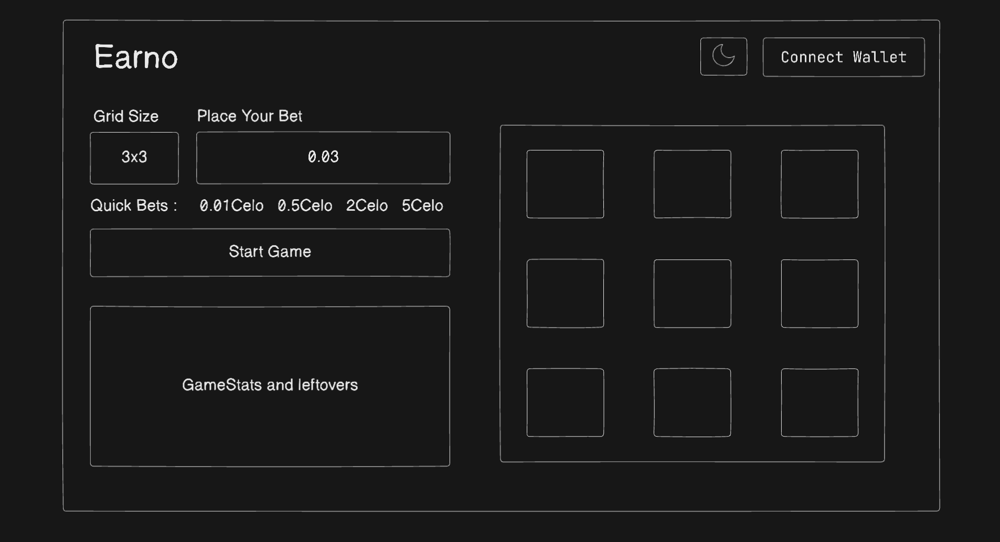
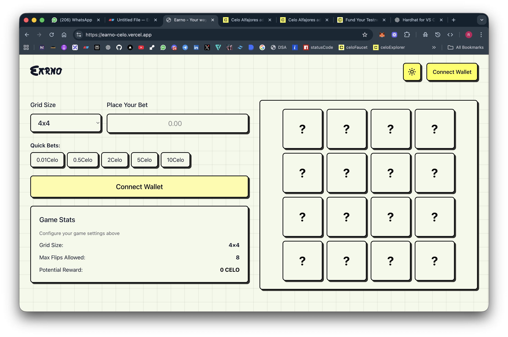
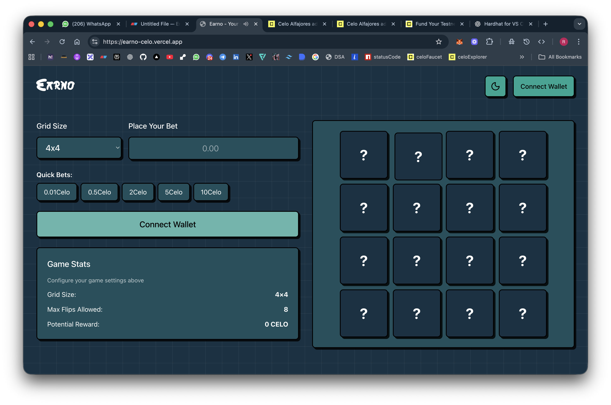
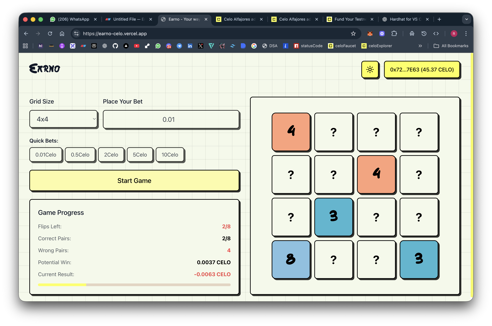
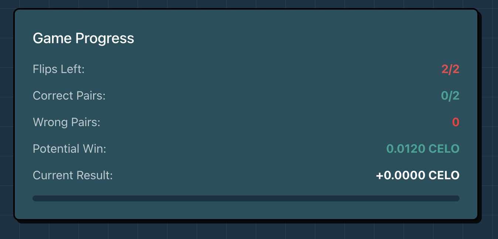
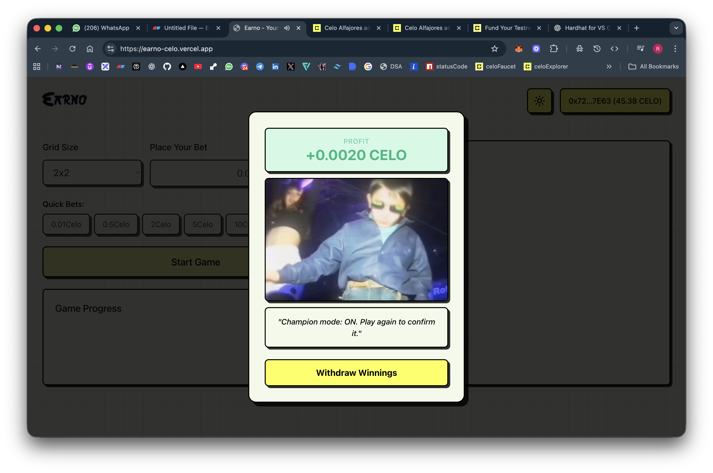
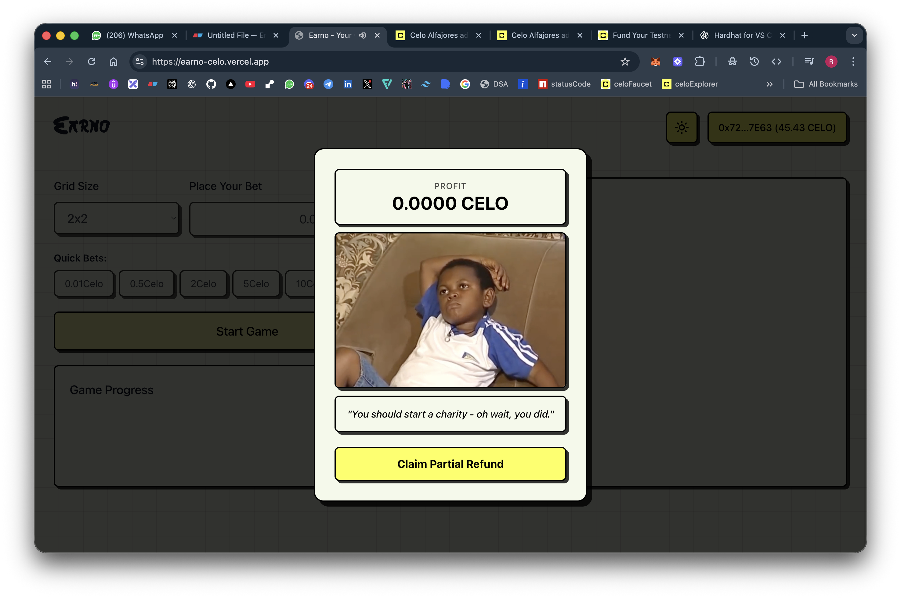
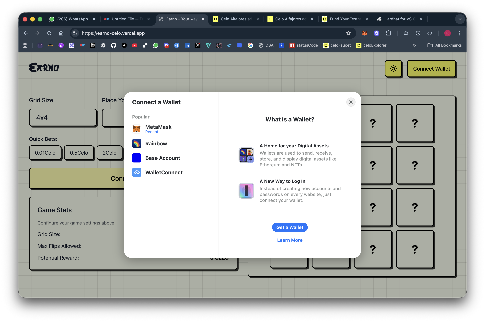

# 🎮 Earno - Memory Game on Celo

> **Your way to earn while you play!**

Earno is a decentralized memory card game built on the Celo Mainnet where players can bet CELO tokens and earn rewards based on their performance. The better you play, the more you earn!

[](https://reactjs.org/)
[](https://soliditylang.org/)
[](https://celo.org/)
[](https://opensource.org/licenses/MIT)

---

## 📋 Table of Contents

- [Overview](#overview)
- [Features](#features)
- [Screenshots](#screenshots)
- [Smart Contract](#smart-contract)
- [Tech Stack](#tech-stack)
- [Getting Started](#getting-started)
- [How to Play](#how-to-play)
- [Game Rules & Rewards](#game-rules--rewards)
- [Project Structure](#project-structure)
- [Development](#development)
- [Deployment](#deployment)
- [Contributing](#contributing)
- [License](#license)

---

## 🌟 Overview

Earno combines the classic memory card matching game with blockchain technology, allowing players to:

- **Bet CELO tokens** on their memory skills
- **Earn proportional rewards** based on game performance
- **Compete** across different difficulty levels (2x2, 4x4, 6x6, 8x8 grids)
- **Win up to 2.5x** their bet amount on perfect games

The game is powered by a Solidity smart contract deployed on Celo Mainnet, ensuring transparent and trustless gameplay with real CELO rewards.

---

## ✨ Features

### 🎯 Core Features

- **Multiple Difficulty Levels**: Choose from 2x2, 4x4, 6x6, or 8x8 grids
- **Progressive Rewards**: Higher multipliers for larger grids (1.2x - 2.5x)
- **Proportional Payouts**: Get partial refunds even if you don't match all pairs
- **Prize Pool System**: Contract owner can fund prize pool for sustainable rewards
- **Real-time Stats**: Track your matches, flips, and potential rewards
- **Wallet Integration**: Connect via MetaMask, Rainbow, WalletConnect, and more

### 🔒 Security Features

- **Decentralized**: All game logic and fund management on-chain
- **Transparent**: Open-source smart contract
- **Non-custodial**: You control your funds
- **Auditable**: All transactions verifiable on Celo block explorer

---

## 📸 Screenshots

### Game Wireframe



### Home Screen



_Connect your wallet and choose your difficulty level_

### Game Board


_Match pairs to earn rewards - the more you match, the more you earn_

### Game Stats


_Real-time tracking of your performance and potential rewards_

### Winning Screen


_Celebrate your win and withdraw your earnings_

### Losing Screen


_"Pandavo ko v krishna bet harne ke bad hi mile the"_

### Wallet Connection


_Multiple wallet options powered by RainbowKit_

---

## 📝 Smart Contract

### Deployed Contract Address

```
0x37E170C1853999bcDb71B2633C406c8b8Bb23334
```

**Network**: Celo Mainnet (Chain ID: 42220)  
**Compiler**: Solidity 0.8.20  
**Block Explorer**: [View on CeloScan](https://celoscan.io/address/0x37E170C1853999bcDb71B2633C406c8b8Bb23334)

**Previous Testnet Contract**: `0x8E22e7b63FBF78a9d5CA69262Fb0E53e2FD5Dc8f` (Alfajores)

### Contract Features

- **Deposits**: Players deposit CELO to start a game
- **Withdrawals**: Players can withdraw their winnings (proportional to performance)
- **Prize Pool**: Owner can fund the prize pool to ensure payouts exceed deposits
- **Balance Tracking**: Tracks individual player deposits and contract balance

### Contract Functions

```solidity
function deposit() external payable
function withdraw(uint256 amount) external
function fundPrizePool() external payable
function getBalance(address player) external view returns (uint256)
function getContractBalance() external view returns (uint256)
```

### Events

```solidity
event Deposited(address indexed player, uint256 amount)
event Withdrawn(address indexed player, uint256 amount)
event PrizePoolFunded(uint256 amount)
```

---

## 🛠 Tech Stack

### Frontend

- **React 19.1.1** - UI framework
- **TypeScript** - Type safety
- **Vite 7.1.7** - Build tool & dev server
- **Tailwind CSS 4.1.15** - Styling
- **Framer Motion** - Animations
- **Lucide React** - Icons

### Web3 Integration

- **Wagmi 2.18.2** - React hooks for Ethereum
- **Viem 2.38.3** - TypeScript Ethereum library
- **RainbowKit 2.2.9** - Wallet connection UI
- **TanStack Query** - Async state management

### Smart Contract

- **Solidity 0.8.20** - Smart contract language
- **Hardhat 2.22.0** - Development environment
- **Celo Mainnet** - Production deployment
- **Celo Alfajores** - Testnet for development

---

## 🚀 Getting Started

### Prerequisites

- **Node.js** (v18 or higher)
- **npm** or **yarn**
- **MetaMask** or any Web3 wallet
- **Real CELO tokens** for mainnet (buy from exchanges like Binance, Coinbase)
- **Celo Alfajores testnet** CELO for testing ([Get from faucet](https://faucet.celo.org/alfajores))

### Installation

1. **Clone the repository**

```bash
git clone https://github.com/rcd-env/earno.git
cd earno
```

2. **Install client dependencies**

```bash
cd client
npm install
```

3. **Install contract dependencies** (optional, for development)

```bash
cd ../contract
npm install
```

4. **Configure environment variables**

Create `.env` file in the `contract` directory:

```env
PRIVATE_KEY=your_private_key_here
```

**⚠️ Security Warning**: Never commit `.env` file to git. Keep your private key secure!

5. **Run the development server**

```bash
cd client
npm run dev
```

6. **Open your browser**
   Navigate to `http://localhost:5173`

---

## 🎮 How to Play

1. **Connect Wallet**

   - Click "Connect Wallet" button
   - Select your preferred wallet (MetaMask, Rainbow, etc.)
   - Approve the connection

2. **Choose Difficulty**

   - Select grid size: 2x2, 4x4, 6x6, or 8x8
   - Larger grids = higher potential rewards

3. **Place Your Bet**

   - Enter the amount of CELO you want to bet
   - Approve the deposit transaction

4. **Play the Game**

   - Click cards to reveal them
   - Match pairs of identical cards
   - Limited flips based on grid size

5. **Claim Your Rewards**
   - After the game ends, your reward is calculated
   - Click "Withdraw" to claim your earnings
   - Approve the withdrawal transaction

---

## 💰 Game Rules & Rewards

### Reward Multipliers by Grid Size

| Grid Size | Total Pairs | Max Flips | Reward Multiplier |
| --------- | ----------- | --------- | ----------------- |
| 2x2       | 2 pairs     | 2 flips   | 1.2x              |
| 4x4       | 8 pairs     | 8 flips   | 1.5x              |
| 6x6       | 18 pairs    | 18 flips  | 2.0x              |
| 8x8       | 32 pairs    | 32 flips  | 2.5x              |

### Proportional Rewards System

Your final payout is calculated proportionally based on your performance:

```
Earned Reward = (Correct Pairs / Total Pairs) × Max Possible Reward
```

**Examples:**

- **Perfect Game (8x8)**: Bet 10 CELO → Match all 32 pairs → Earn 25 CELO (15 CELO profit)
- **Partial Win (4x4)**: Bet 5 CELO → Match 4/8 pairs → Earn 3.75 CELO (1.25 CELO loss)
- **50% Success (2x2)**: Bet 2 CELO → Match 1/2 pairs → Earn 1.2 CELO (0.8 CELO loss)

### Game Over Conditions

- **Out of flips**: Used all available flips
- **Wrong pairs**: Made too many incorrect matches
- **Victory**: Matched all pairs successfully

---

## 📁 Project Structure

```
earno/
├── client/                  # Frontend React application
│   ├── public/
│   │   └── images/         # Static images
│   ├── src/
│   │   ├── components/     # React components
│   │   │   ├── GameBoard.tsx
│   │   │   ├── GameStart.tsx
│   │   │   ├── GameResult.tsx
│   │   │   ├── GameStats.tsx
│   │   │   ├── Card.tsx
│   │   │   └── wallet-connect.tsx
│   │   ├── hooks/          # Custom React hooks
│   │   │   └── useMemoryGame.ts
│   │   ├── lib/            # Configuration & utilities
│   │   │   ├── contract.ts # Contract ABI & address
│   │   │   ├── wagmi.ts    # Wagmi configuration
│   │   │   └── config.ts   # App configuration
│   │   ├── App.tsx         # Main app component
│   │   └── main.tsx        # Entry point
│   ├── package.json
│   └── vite.config.ts
│
├── contract/               # Smart contract
│   ├── contracts/
│   │   └── MemoryGame.sol  # Main game contract
│   ├── scripts/
│   │   ├── deploy.js       # Deployment script
│   │   └── fundPrizePool.js # Prize pool funding script
│   ├── hardhat.config.js   # Hardhat configuration
│   └── package.json
│
├── docs/                   # Documentation
│   └── screenshots/        # App screenshots
│
└── README.md              # This file
```

---

## 🔧 Development

### Running Tests

```bash
# Contract tests
cd contract
npx hardhat test

# Frontend type checking
cd client
npm run typecheck
```

### Linting

```bash
cd client
npm run lint
```

### Building for Production

```bash
cd client
npm run build
```

The production build will be in `client/dist/` directory.

### Local Development with Hardhat

1. **Start local Hardhat node**

```bash
cd contract
npx hardhat node
```

2. **Deploy contract locally**

```bash
npx hardhat run scripts/deploy.js --network localhost
```

3. **Update contract address** in `client/src/lib/contract.ts`

---

## 🚀 Deployment

### Deploy Smart Contract to Mainnet

1. **Set up environment variables**

```bash
cd contract
# Add your private key to .env file
echo "PRIVATE_KEY=your_private_key_here" > .env
```

2. **Ensure you have CELO for gas**

You need at least 1-2 CELO in your wallet:
- For deployment gas fees (~0.5 CELO)
- For funding the prize pool (optional, recommended 10-100 CELO)

3. **Deploy to Celo Mainnet**

```bash
npx hardhat run scripts/deploy-mainnet.js --network celo
```

This will output your contract address. Save it!

4. **Fund the prize pool (optional but recommended)**

Edit `scripts/fund-mainnet.js` with your contract address and desired amount:

```javascript
const CONTRACT_ADDRESS = "0x37E170C1853999bcDb71B2633C406c8b8Bb23334";
const FUND_AMOUNT = "10"; // Amount in CELO
```

Then run:

```bash
npx hardhat run scripts/fund-mainnet.js --network celo
```

5. **Update client configuration**

Update `client/src/lib/contract.ts` with your new contract address.

### Deploy to Testnet (for testing)

```bash
npx hardhat run scripts/deploy.js --network alfajores
```

### Verify Contract (optional)

```bash
npx hardhat verify --network celo 0x37E170C1853999bcDb71B2633C406c8b8Bb23334
```

### Deploy Frontend

The frontend can be deployed to various platforms:

**Vercel** (Recommended)

```bash
cd client
vercel --prod
```

**Netlify**

```bash
cd client
npm run build
netlify deploy --prod --dir=dist
```

**GitHub Pages**

```bash
cd client
npm run build
# Push dist/ folder to gh-pages branch
```

---

## 🤝 Contributing

Contributions are welcome! Please follow these steps:

1. Fork the repository
2. Create a feature branch (`git checkout -b feature/amazing-feature`)
3. Commit your changes (`git commit -m 'Add amazing feature'`)
4. Push to the branch (`git push origin feature/amazing-feature`)
5. Open a Pull Request

### Development Guidelines

- Follow existing code style
- Add tests for new features
- Update documentation as needed
- Ensure all tests pass before submitting PR

---

## 🌐 Mainnet vs Testnet

### Current Deployment: Celo Mainnet

**Mainnet Contract**: `0x37E170C1853999bcDb71B2633C406c8b8Bb23334`
- ✅ Real CELO tokens
- ✅ Real rewards and prizes
- ✅ Production-ready
- ⚠️ Requires real funds

### Testnet (for Development)

**Testnet Contract**: `0x8E22e7b63FBF78a9d5CA69262Fb0E53e2FD5Dc8f` (Alfajores)
- ✅ Free test tokens
- ✅ Safe for testing
- ✅ No real money risk
- 🔗 [Get testnet CELO](https://faucet.celo.org/alfajores)

### Switching Networks

To switch between mainnet and testnet, update the `VITE_USE_MAINNET` environment variable:

**For Mainnet** (default):
```env
VITE_USE_MAINNET=true
```

**For Testnet**:
```env
VITE_USE_MAINNET=false
```

---

## 📄 License

This project is licensed under the MIT License - see the [LICENSE](LICENSE) file for details.

---

## 🙏 Acknowledgments

- **Celo Foundation** - For the amazing blockchain platform
- **RainbowKit** - For the beautiful wallet connection UI
- **Wagmi & Viem** - For excellent Web3 React hooks
- **Hardhat** - For the robust development environment

---

## 📞 Contact & Support

- **GitHub Issues**: [Report bugs or request features](https://github.com/rcd-env/earno/issues)
- **Celo Discord**: Join the Celo community for support

---

## 🔗 Links

- **Live Demo**: [Earno on Vercel](https://earno-celo.vercel.app)
- **Mainnet Contract**: [View on CeloScan](https://celoscan.io/address/0x37E170C1853999bcDb71B2633C406c8b8Bb23334)
- **Testnet Contract**: [View on BlockScout](https://celo-alfajores.blockscout.com/address/0x8E22e7b63FBF78a9d5CA69262Fb0E53e2FD5Dc8f)
- **Celo Faucet** (testnet): [https://faucet.celo.org/alfajores](https://faucet.celo.org/alfajores)
- **Celo Documentation**: [https://docs.celo.org](https://docs.celo.org)
- **Buy CELO**: [Binance](https://www.binance.com/en/trade/CELO_USDT) | [Coinbase](https://www.coinbase.com/price/celo)

---

<div align="center">

Made with ❤️ for the Celo ecosystem

**[⬆ back to top](#-earno---memory-game-on-celo)**

</div>
