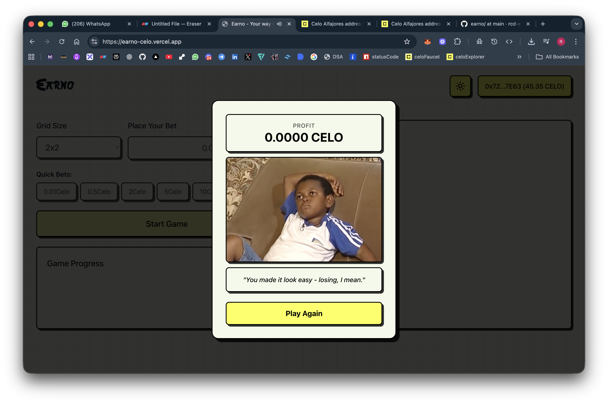

# 🎮 Earno - Memory Game on Celo

> **Your way to earn while you play!**

Earno is a decentralized memory card game built on the Celo Alfajores testnet where players can bet CELO tokens and earn rewards based on their performance. The better you play, the more you earn!

[](https://reactjs.org/)
[](https://soliditylang.org/)
[](https://celo.org/)
[](https://opensource.org/licenses/MIT)

---

## 📋 Table of Contents

- [Overview](#overview)
- [Features](#features)
- [Screenshots](#screenshots)
- [Smart Contract](#smart-contract)
- [Tech Stack](#tech-stack)
- [Getting Started](#getting-started)
- [How to Play](#how-to-play)
- [Game Rules & Rewards](#game-rules--rewards)
- [Project Structure](#project-structure)
- [Development](#development)
- [Deployment](#deployment)
- [Contributing](#contributing)
- [License](#license)

---

## 🌟 Overview

Earno combines the classic memory card matching game with blockchain technology, allowing players to:

- **Bet CELO tokens** on their memory skills
- **Earn proportional rewards** based on game performance
- **Compete** across different difficulty levels (2x2, 4x4, 6x6, 8x8 grids)
- **Win up to 2.5x** their bet amount on perfect games

The game is powered by a Solidity smart contract deployed on Celo Alfajores testnet, ensuring transparent and trustless gameplay.

---

## ✨ Features

### 🎯 Core Features

- **Multiple Difficulty Levels**: Choose from 2x2, 4x4, 6x6, or 8x8 grids
- **Progressive Rewards**: Higher multipliers for larger grids (1.2x - 2.5x)
- **Proportional Payouts**: Get partial refunds even if you don't match all pairs
- **Prize Pool System**: Contract owner can fund prize pool for sustainable rewards
- **Real-time Stats**: Track your matches, flips, and potential rewards
- **Wallet Integration**: Connect via MetaMask, Rainbow, WalletConnect, and more

### 🔒 Security Features

- **Decentralized**: All game logic and fund management on-chain
- **Transparent**: Open-source smart contract
- **Non-custodial**: You control your funds
- **Auditable**: All transactions verifiable on Celo block explorer

---

## 📸 Screenshots

### Game Wireframe


### Home Screen


_Connect your wallet and choose your difficulty level_

### Game Board


_Match pairs to earn rewards - the more you match, the more you earn_

### Game Stats


_Real-time tracking of your performance and potential rewards_

### Winning Screen


_Celebrate your win and withdraw your earnings_

### Losing Screen


_"Shree Krishna ko v madhav betting harne ke bad hi mile the"_

### Wallet Connection


_Multiple wallet options powered by RainbowKit_

---

## 📝 Smart Contract

### Deployed Contract Address

```
0x8E22e7b63FBF78a9d5CA69262Fb0E53e2FD5Dc8f
```

**Network**: Celo Alfajores Testnet  
**Compiler**: Solidity 0.8.20  
**Block Explorer**: [View on BlackScout](https://celo-alfajores.blockscout.com/address/0x8E22e7b63FBF78a9d5CA69262Fb0E53e2FD5Dc8f?tab=index)

### Contract Features

- **Deposits**: Players deposit CELO to start a game
- **Withdrawals**: Players can withdraw their winnings (proportional to performance)
- **Prize Pool**: Owner can fund the prize pool to ensure payouts exceed deposits
- **Balance Tracking**: Tracks individual player deposits and contract balance

### Contract Functions

```solidity
function deposit() external payable
function withdraw(uint256 amount) external
function fundPrizePool() external payable
function getBalance(address player) external view returns (uint256)
function getContractBalance() external view returns (uint256)
```

### Events

```solidity
event Deposited(address indexed player, uint256 amount)
event Withdrawn(address indexed player, uint256 amount)
event PrizePoolFunded(uint256 amount)
```

---

## 🛠 Tech Stack

### Frontend

- **React 19.1.1** - UI framework
- **TypeScript** - Type safety
- **Vite 7.1.7** - Build tool & dev server
- **Tailwind CSS 4.1.15** - Styling
- **Framer Motion** - Animations
- **Lucide React** - Icons

### Web3 Integration

- **Wagmi 2.18.2** - React hooks for Ethereum
- **Viem 2.38.3** - TypeScript Ethereum library
- **RainbowKit 2.2.9** - Wallet connection UI
- **TanStack Query** - Async state management

### Smart Contract

- **Solidity 0.8.20** - Smart contract language
- **Hardhat 2.22.0** - Development environment
- **Celo Alfajores** - Testnet deployment

---

## 🚀 Getting Started

### Prerequisites

- **Node.js** (v18 or higher)
- **npm** or **yarn**
- **MetaMask** or any Web3 wallet
- **Celo Alfajores testnet** CELO tokens ([Get from faucet](https://faucet.celo.org/alfajores))

### Installation

1. **Clone the repository**

```bash
git clone https://github.com/rcd-env/earno.git
cd earno
```

2. **Install client dependencies**

```bash
cd client
npm install
```

3. **Install contract dependencies** (optional, for development)

```bash
cd ../contract
npm install
```

4. **Configure environment variables**

Create `.env` file in the `contract` directory:

```env
PRIVATE_KEY=your_private_key_here
CELO_ALFAJORES_RPC=https://alfajores-forno.celo-testnet.org
```

5. **Run the development server**

```bash
cd client
npm run dev
```

6. **Open your browser**
   Navigate to `http://localhost:5173`

---

## 🎮 How to Play

1. **Connect Wallet**

   - Click "Connect Wallet" button
   - Select your preferred wallet (MetaMask, Rainbow, etc.)
   - Approve the connection

2. **Choose Difficulty**

   - Select grid size: 2x2, 4x4, 6x6, or 8x8
   - Larger grids = higher potential rewards

3. **Place Your Bet**

   - Enter the amount of CELO you want to bet
   - Approve the deposit transaction

4. **Play the Game**

   - Click cards to reveal them
   - Match pairs of identical cards
   - Limited flips based on grid size

5. **Claim Your Rewards**
   - After the game ends, your reward is calculated
   - Click "Withdraw" to claim your earnings
   - Approve the withdrawal transaction

---

## 💰 Game Rules & Rewards

### Reward Multipliers by Grid Size

| Grid Size | Total Pairs | Max Flips | Reward Multiplier |
| --------- | ----------- | --------- | ----------------- |
| 2x2       | 2 pairs     | 2 flips   | 1.2x              |
| 4x4       | 8 pairs     | 8 flips   | 1.5x              |
| 6x6       | 18 pairs    | 18 flips  | 2.0x              |
| 8x8       | 32 pairs    | 32 flips  | 2.5x              |

### Proportional Rewards System

Your final payout is calculated proportionally based on your performance:

```
Earned Reward = (Correct Pairs / Total Pairs) × Max Possible Reward
```

**Examples:**

- **Perfect Game (8x8)**: Bet 10 CELO → Match all 32 pairs → Earn 25 CELO (15 CELO profit)
- **Partial Win (4x4)**: Bet 5 CELO → Match 4/8 pairs → Earn 3.75 CELO (1.25 CELO loss)
- **50% Success (2x2)**: Bet 2 CELO → Match 1/2 pairs → Earn 1.2 CELO (0.8 CELO loss)

### Game Over Conditions

- **Out of flips**: Used all available flips
- **Wrong pairs**: Made too many incorrect matches
- **Victory**: Matched all pairs successfully

---

## 📁 Project Structure

```
earno/
├── client/                  # Frontend React application
│   ├── public/
│   │   └── images/         # Static images
│   ├── src/
│   │   ├── components/     # React components
│   │   │   ├── GameBoard.tsx
│   │   │   ├── GameStart.tsx
│   │   │   ├── GameResult.tsx
│   │   │   ├── GameStats.tsx
│   │   │   ├── Card.tsx
│   │   │   └── wallet-connect.tsx
│   │   ├── hooks/          # Custom React hooks
│   │   │   └── useMemoryGame.ts
│   │   ├── lib/            # Configuration & utilities
│   │   │   ├── contract.ts # Contract ABI & address
│   │   │   ├── wagmi.ts    # Wagmi configuration
│   │   │   └── config.ts   # App configuration
│   │   ├── App.tsx         # Main app component
│   │   └── main.tsx        # Entry point
│   ├── package.json
│   └── vite.config.ts
│
├── contract/               # Smart contract
│   ├── contracts/
│   │   └── MemoryGame.sol  # Main game contract
│   ├── scripts/
│   │   ├── deploy.js       # Deployment script
│   │   └── fundPrizePool.js # Prize pool funding script
│   ├── hardhat.config.js   # Hardhat configuration
│   └── package.json
│
├── docs/                   # Documentation
│   └── screenshots/        # App screenshots
│
└── README.md              # This file
```

---

## 🔧 Development

### Running Tests

```bash
# Contract tests
cd contract
npx hardhat test

# Frontend type checking
cd client
npm run typecheck
```

### Linting

```bash
cd client
npm run lint
```

### Building for Production

```bash
cd client
npm run build
```

The production build will be in `client/dist/` directory.

### Local Development with Hardhat

1. **Start local Hardhat node**

```bash
cd contract
npx hardhat node
```

2. **Deploy contract locally**

```bash
npx hardhat run scripts/deploy.js --network localhost
```

3. **Update contract address** in `client/src/lib/contract.ts`

---

## 🚀 Deployment

### Deploy Smart Contract

1. **Set up environment variables**

```bash
cd contract
cp .env.example .env
# Edit .env with your private key
```

2. **Deploy to Celo Alfajores**

```bash
npx hardhat run scripts/deploy.js --network alfajores
```

3. **Verify contract** (optional)

```bash
npx hardhat verify --network alfajores DEPLOYED_CONTRACT_ADDRESS
```

4. **Fund the prize pool**

```bash
FUND_AMOUNT=10 npx hardhat run scripts/fundPrizePool.js --network alfajores
```

### Deploy Frontend

The frontend can be deployed to various platforms:

**Vercel** (Recommended)

```bash
cd client
vercel --prod
```

**Netlify**

```bash
cd client
npm run build
netlify deploy --prod --dir=dist
```

**GitHub Pages**

```bash
cd client
npm run build
# Push dist/ folder to gh-pages branch
```

---

## 🤝 Contributing

Contributions are welcome! Please follow these steps:

1. Fork the repository
2. Create a feature branch (`git checkout -b feature/amazing-feature`)
3. Commit your changes (`git commit -m 'Add amazing feature'`)
4. Push to the branch (`git push origin feature/amazing-feature`)
5. Open a Pull Request

### Development Guidelines

- Follow existing code style
- Add tests for new features
- Update documentation as needed
- Ensure all tests pass before submitting PR

---

## 📄 License

This project is licensed under the MIT License - see the [LICENSE](LICENSE) file for details.

---

## 🙏 Acknowledgments

- **Celo Foundation** - For the amazing blockchain platform
- **RainbowKit** - For the beautiful wallet connection UI
- **Wagmi & Viem** - For excellent Web3 React hooks
- **Hardhat** - For the robust development environment

---

## 📞 Contact & Support

- **GitHub Issues**: [Report bugs or request features](https://github.com/rcd-env/earno/issues)
- **Celo Discord**: Join the Celo community for support

---

## 🔗 Links

- **Live Demo**: [Coming Soon]
- **Contract on Celoscan**: [0x8E22e7b63FBF78a9d5CA69262Fb0E53e2FD5Dc8f](https://alfajores.celoscan.io/address/0x8E22e7b63FBF78a9d5CA69262Fb0E53e2FD5Dc8f)
- **Celo Faucet**: [https://faucet.celo.org/alfajores](https://faucet.celo.org/alfajores)
- **Celo Documentation**: [https://docs.celo.org](https://docs.celo.org)

---

<div align="center">

Made with ❤️ for the Celo ecosystem

**[⬆ back to top](#-earno---memory-game-on-celo)**

</div>
